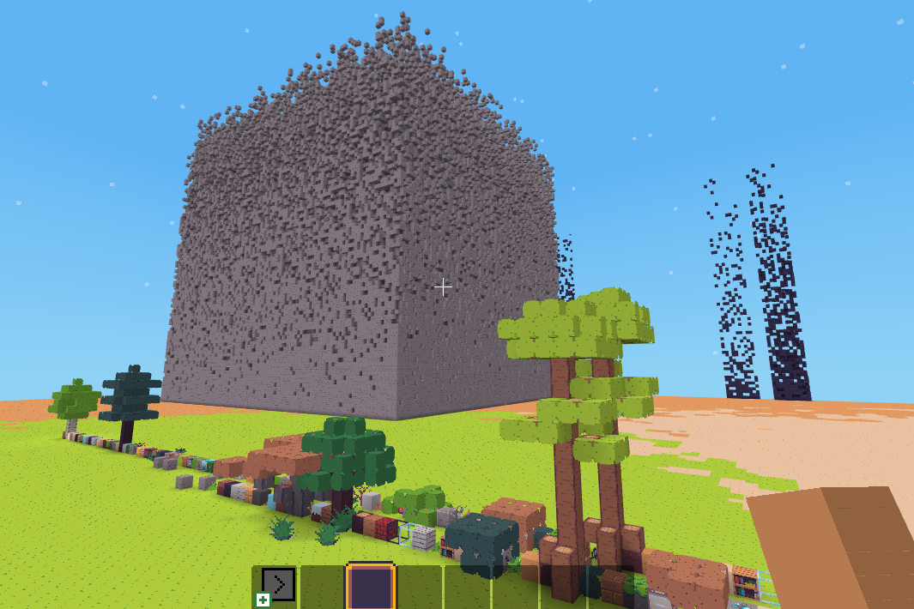

CodeBlock
=========================

**CodeBlock allows to use `lua` code in Minetest to build anything you want**

**License:** GPLv3   
**Credits:** inspired by [Gnancraft](http://gnancraft.net/), [ComputerCraft](http://www.computercraft.info/), [Visual Bots](https://content.minetest.net/packages/Nigel/vbots/), [TurtleMiner](https://content.minetest.net/packages/BirgitLachner/turtleminer/), [basic_robot](https://github.com/ac-minetest/basic_robot)

## Quick start

### Run your first program

1. Create an empty (flat) world, enable `codeblock` mod ant its dependencies
2. Enable creative mode and start the game
3. Right click with  tool on a block to place the drone, choose `example.lua` then left click with  to start the drone

### Write your first program

1. Right click with  tool to open the `lua` editor
2. Create a new file with the `new file` field and write some code on the main window
3. Click `load and exit` to load your code in the drone
4. Right click with  tool on a block and run the code with a left click on 
5. Read the [Lua API](https://github.com/gigaturbo/codeblock/blob/master/doc/api.md#lua-api) in `doc/api.md` to know which commands and blocks you can use!

### More examples

1. Generate built-in examples by typing in chat `/codegenerate`
2. Open the editor and choose an example to run
3. Some examples require greater [permisisons](https://github.com/gigaturbo/codeblock/blob/master/doc/api.md#codelevel) to be run and running the program will return an error. In this case grant yourself the mod permission with `/grantme codeblock` and use `/codelevel 4` to grant you full power (see [chat commands](https://github.com/gigaturbo/codeblock/blob/master/doc/api.md#chat-commands)).